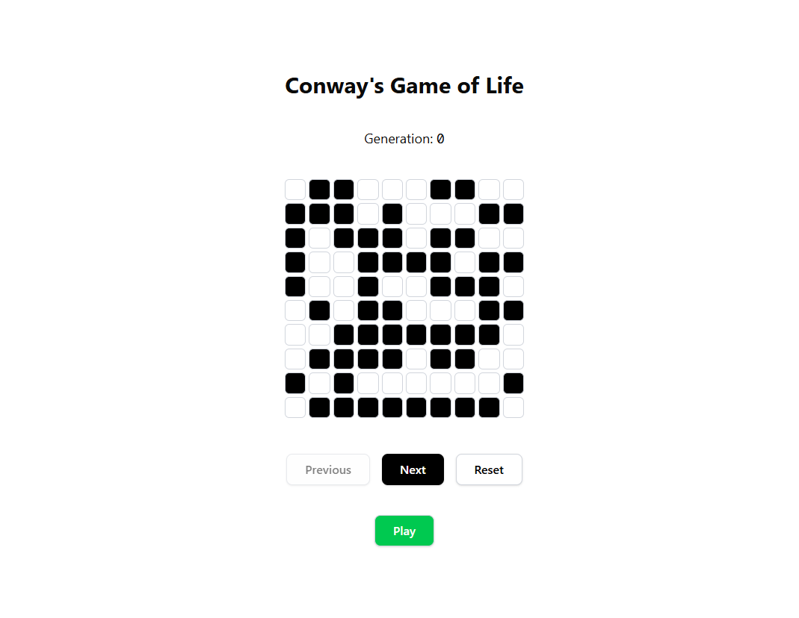

# Conwayのライフゲーム (Next.js版)

## 概要
このプロジェクトは、Next.js・TypeScript・Tailwind CSS・shadcn/uiを用いて実装した「Conwayのライフゲーム」です。シンプルかつモダンなUIで、ライフゲームのルールを体験できます。

## 主な機能
- **8x8のセルグリッド表示**（サイズ可変対応）
- **セルのクリックで生死をトグル**
- **Nextボタンで次世代へ進む**
- **Resetボタンで初期化**
- **Previousボタンで1世代前に戻る**
- **Play/Stopボタンで自動再生・停止**
- **世代カウンター表示**
- **TypeScriptによる型安全な実装**
- **Tailwind CSS & shadcn/uiによる美しいUI**

## 使い方
1. `npm install` で依存パッケージをインストール
2. `npm run dev` で開発サーバーを起動
3. ブラウザで `http://localhost:3000` を開く

以下は、JDDの技術面接を想定した **実装説明スクリプト（Next.js/React課題）** です。自信を持って自分の意図と判断を説明できるよう整理しました。

## 🗣 実装全体の構成意図

> 今回は、Conway's Game of Life を React + TypeScript + Vite + Tailwind CSS で実装しました。実装にあたっては以下の3点を意識しました：
>
> 1. **ロジックとUIの責務分離**
> 2. **再利用可能な設計**
> 3. **開発効率とコードの可読性**

## 🧠 useGameOfLife.ts（状態管理の設計）

> 状態管理のカスタムフック`useGameOfLife`を作成しました。ここでは `grid`（2次元配列）と `generation` の状態を管理し、「次の世代への更新」と「初期化」機能を提供しています。
>
> `setGrid(prev => getNextGrid(prev))`という形式で、状態を不変に保ちつつ更新できるように設計しています。

## 📦 lib/grid.ts（ロジックの分離）

> ゲームのロジックは`lib/grid.ts`に切り出しました。これは以下の理由です：
>
> * UIから切り離し、テストしやすくする
> * 状態更新のルールが複雑なので、責務を限定する
>
> `switch`文で条件分岐を網羅し、「過疎死」「過密死」「生存」「誕生」のルールを明示的に管理しています。

## 💡 Grid.tsx（UIコンポーネント）

> `Grid`は再利用可能な UI コンポーネントとして実装しました。Propsとして受け取った2次元配列`grid`をループし、黒・白で状態を表現しています。
>
> Tailwind CSSを使用することで、クラス名のインライン管理とデザインの高速化を両立しました。

## 改善・リファクタリングの思考プロセス
- **ロジックとUIの分離**: 計算ロジック（lib/grid.ts）とReactフック（hooks/useGameOfLife.ts）を分離し、保守性・テスト容易性を向上。
- **型の一元管理**: 型定義をlibにまとめ、hooksやcomponentsで再利用。
- **カスタムフックの拡張性**: 状態や操作（次世代、リセット、トグル、オート再生、履歴）をグループ化し、`controls`・`history`・`cell`として返却。これにより、UI側での利用が直感的かつ拡張しやすくなりました。
- **UIの柔軟性**: グリッドサイズをpropsで可変にし、再利用性を高めました。
- **ユーザビリティ**: ボタンの無効化や色分け、セルのホバー効果など、直感的な操作感を重視。

## 🔚 まとめ

> 技術選定の理由としては、Next.jsやTypeScriptのような型付きReact環境は、JDDが採用しているスタックにも近く、保守性と拡張性を兼ね備えています。
> シンプルな要件の中でも責務分離や拡張性を意識し、プロダクトコードとしても耐えうる構成を目指しました。

---

### 技術スタック
- Next.js (App Router, TypeScript)
- Tailwind CSS
- shadcn/ui
